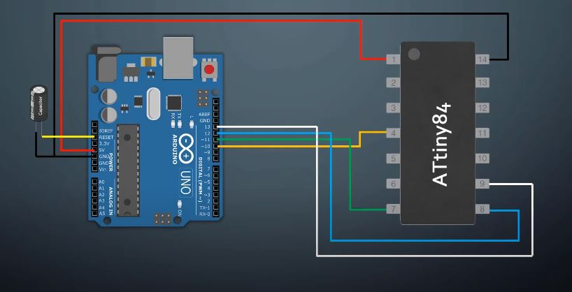
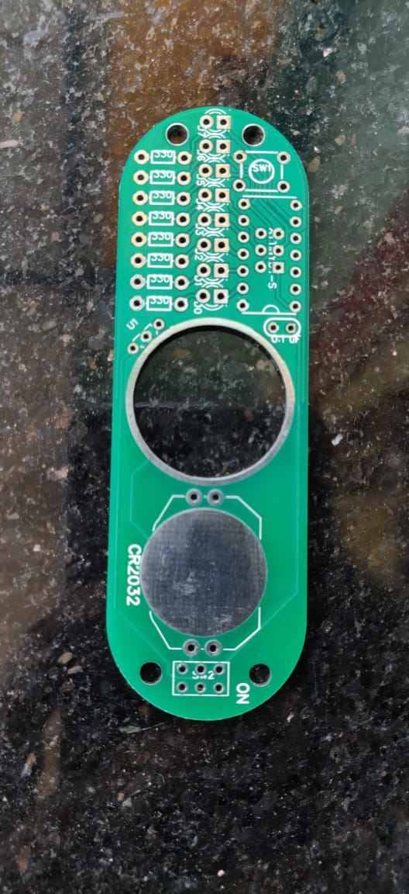
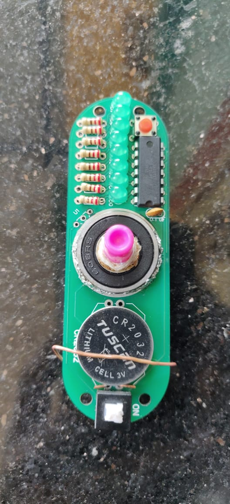
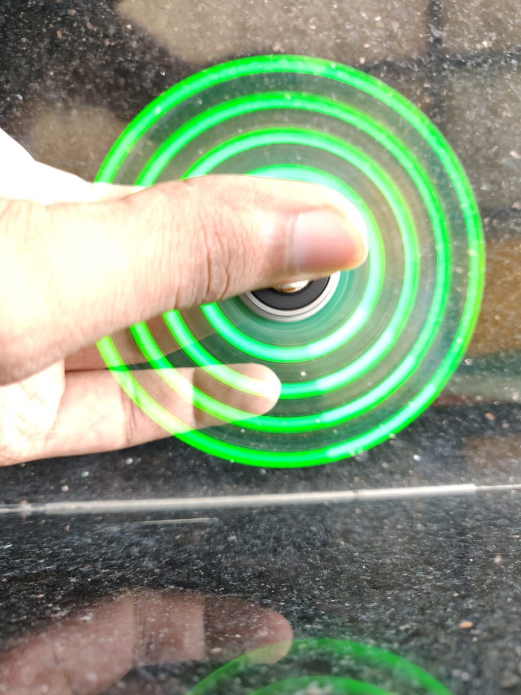
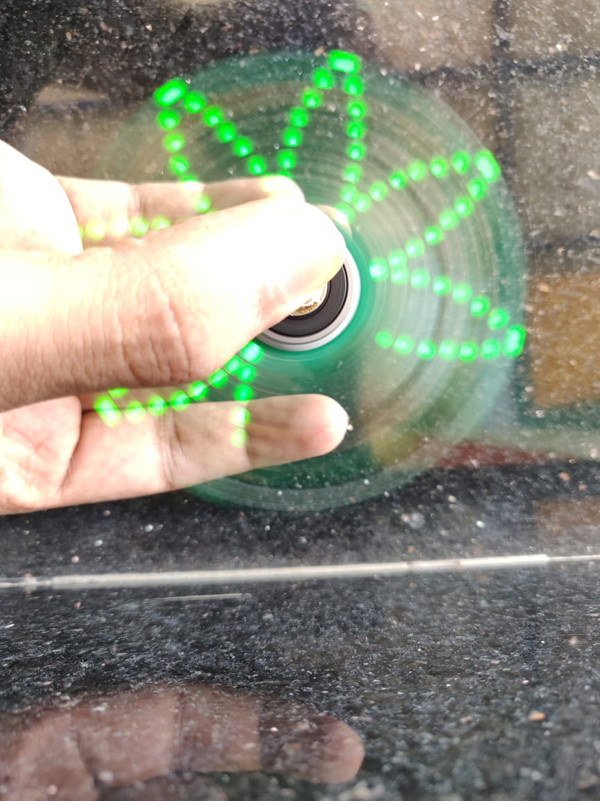
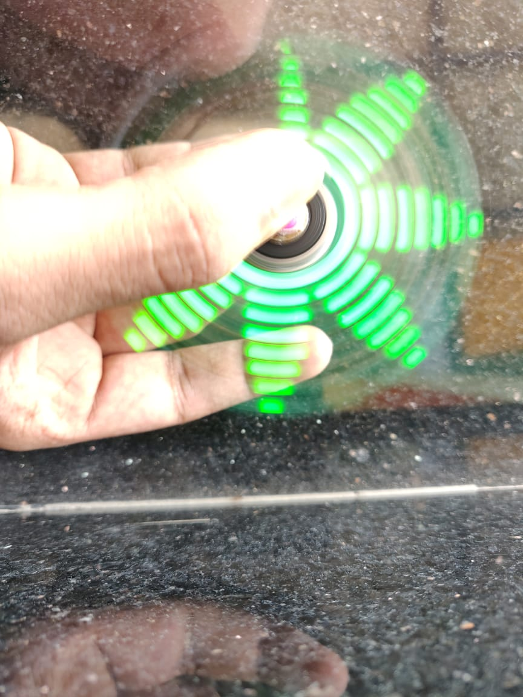
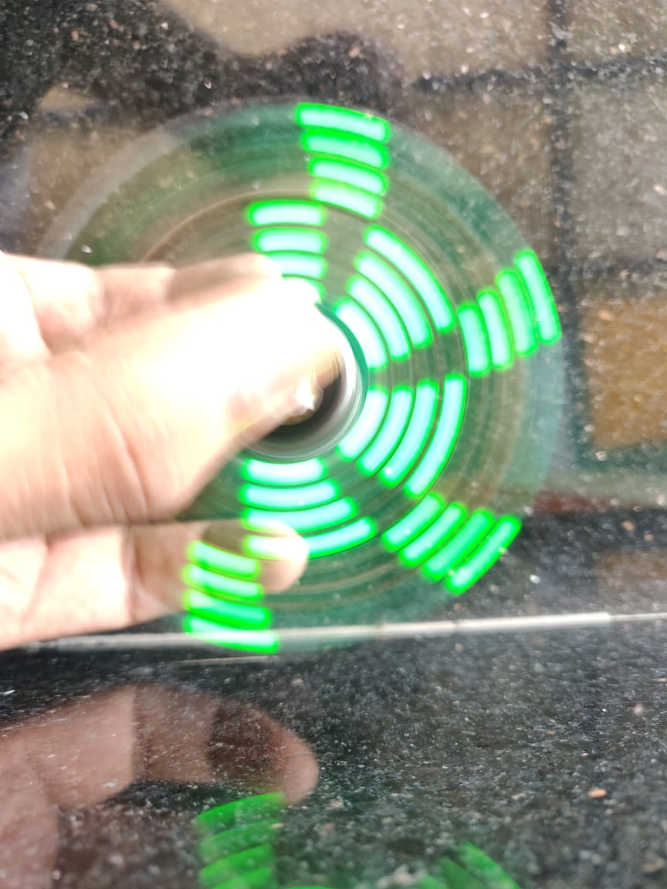
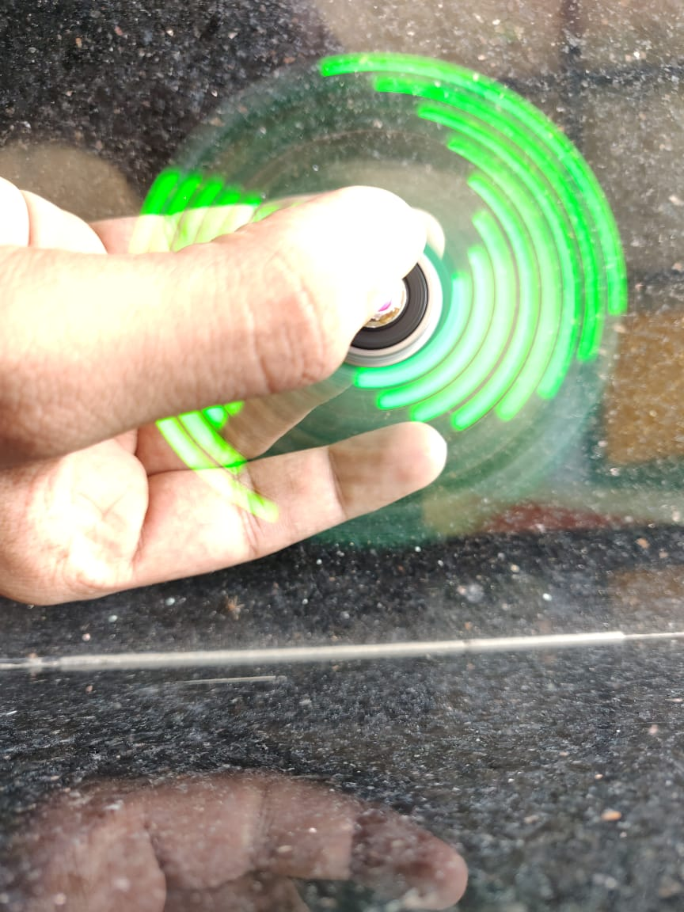
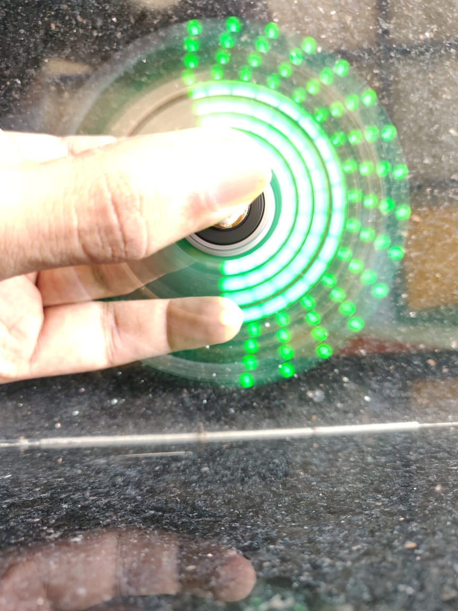
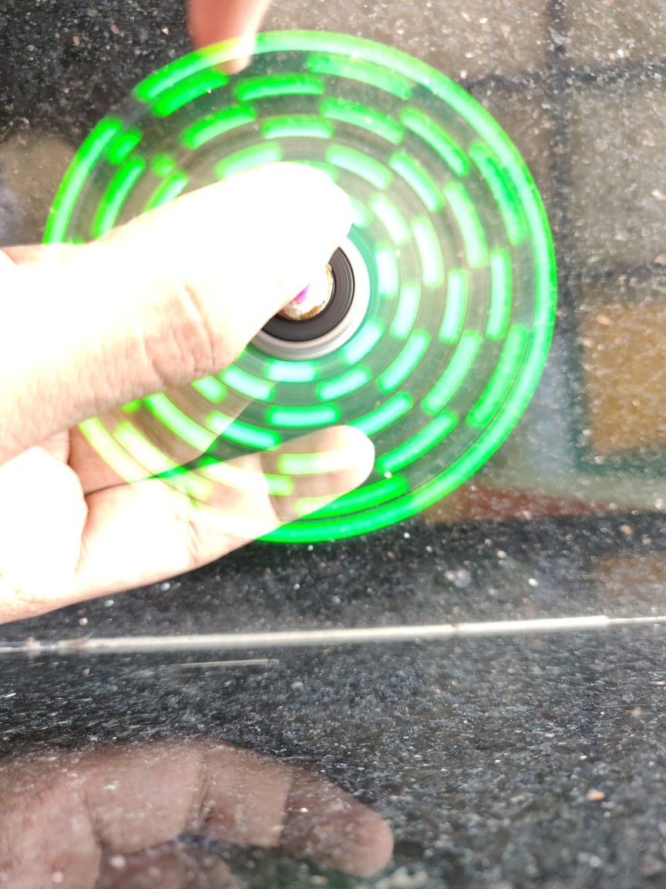

# POV FidgetSpinner

Fidget spinner built from scratch that makes use of the concept of "Persistence of Vision" to produce Cool patterns using LEDs

# PREREQUISITES:
 - Basic knowledge in Arduino
 - Arduino board
 - Soldering Iron and experience using it 
 - Breadboard ,jumper wires

# COMPONENTS REQUIRED: 

_Links given are the ones I used to purchase_

From local Vendors:
 - Resistors (preferably 330 ohms)
 - LEDs(3mm)
 - Switch
 - Pushbutton
 - Capacitor (0.1uF)
 - CR2032 Battery

Buy Online:
 - Attiny84 ([Tanotis](https://www.tanotis.com/products/microchip-attiny84a-pu-8-bit-microcontroller-low-power-high-performance-attiny-20-mhz-8-kb-512-byte-14-pins-dip))
 - Bearing ([Flipkart](https://dl.flipkart.com/dl/tools-centre-hch-10pcs-608-2rs-8x22x7mm-rubber-sealed-ball-bearings-wheel-bearing/p/itmbbd5226a26969?pid=CWGFZPXZZ8QFZV7K&cmpid=product.share.pp))
 - Through hole CR2032 Battery holder(Very rare so I had to tie a hard wire around to hold the battery in place) ([Tanotis-SMD battery holder](https://www.tanotis.com/products/genuine-sparkfun-coin-cell-battery-holder-20mm-smd))
 - [Custom PCB board (Order from PCB Manufacturer)](PCB/README.md)

Manually:
 - Plastic cap(To attach to the bearing to act as holder - **This needs creativity**)

Optional: (If interested in implementing TEXTS,SHAPES) 

_I was not able to implement TEXTS,SHAPES and can't debug due to time constraints_

 - Hall effect sensor ([Flipkart](https://dl.flipkart.com/dl/sl-sales-a3144e-hall-effect-sensor-digital-switch-3-pin-10-pcs-electronic-components-hobby-kit/p/itmc326f1539906a?pid=EHKFYBQ5ERZFYCFD&cmpid=product.share.pp))
 - Neodymium Magnet 2mm X 1.5mm ([Flipkart](https://dl.flipkart.com/dl/sl-sales-a3144e-hall-effect-sensor-digital-switch-3-pin-10-pcs-electronic-components-hobby-kit/p/itmc326f1539906a?pid=EHKFYBQ5ERZFYCFD&cmpid=product.share.pp))

# INSTRUCTIONS:
 - Solder all the components except ATTINY84 to the PCB as marked in the board itself
 - If you aren't making use of Hall effect sensors and magnets,short these two pins right away
 - (image)
 - Bootloading and uploading the code to the Microcontroller:
    - Install support for ATTINY: https://github.com/SpenceKonde/ATTinyCore
    - Upload the "Arduino as ISP sketch" to the Arduino board of yours :[File] -> [Examples] -> [Arduino as ISP]
    - Connect the ATTINY with your arduino board based on the wiring below 
    
   
    - In the arduino IDE:
    - Select the correct chip:
       - Attiny Core: "Attiny 24/44/84"
       - Chip "Attiny 84"
       - 8 Mhz (Internal)
       - Pin Mapping "Counter Clockwise"  
    - Upload the [code](code/code.ino)
 - Now Attiny can be placed on the spinner and debugged accordingly

Before soldering | After soldering
------------ | -------------
 | 

# OUTPUT:
 Mode 1 | Mode 2 | Mode 3 | Mode 4 | Mode 5 | Mode 6 | Mode 7
------------ | ------------- | ------------- | ------------- | ------------- | ------------- | -------------
 |  |  |  | |  | 

Video link: 

### Reference and Credits:
 - https://www.instructables.com/Geek-Spinner/
